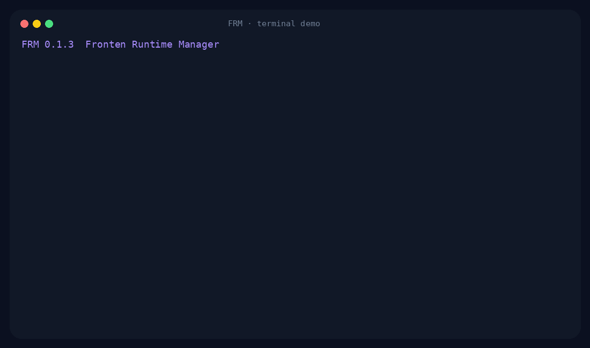

<p align="center">
  
</p>

<p align="center">
  <strong>Discover, inspect, control and verify Oracle HTTP Server runtimes from one Bash CLI.</strong>
</p>

---

# FRM

**FRM — Fronten Runtime Manager** is a local runtime manager for Oracle HTTP Server
estates where multiple OHS generations and instance layouts may coexist on the same
server.

It grew from an operational script used against real OHS 11g/OPMN and OHS 12c
systemd/SysV layouts. FRM normalizes those different generations into the same commands
and the same runtime states.

<p align="center">
  
</p>

## Why FRM

A simple `systemctl status` is not enough for every OHS installation. In particular,
generated SysV units can report `active (exited)` while the actual OHS process lives
separately. OHS 11g introduces another control plane through OPMN and its
`httpd.worker` process layout.

FRM hides those differences behind one state model:

```text
RUNNING   positive runtime confirmation
DOWN      positive confirmation that the runtime is down
WARNING   contradictory backend/process evidence
UNKNOWN   state cannot be established safely
```

## Highlights

- Discovers OHS instances under `/u01/app/oracle/admin` or another configured root.
- Supports mixed **OHS 11g / OPMN** and **OHS 12c / systemd / SysV** estates.
- Confirms 12c runtime state against real `httpd` processes.
- Uses wide `ps` snapshots so long OHS command lines remain attributable on RHEL7/procps.
- Resolves 11g `httpd.worker` masters even when the instance path is only visible in
  their child logging processes.
- Select one instance, several instances, or quoted glob patterns.
- Repeated exclusion patterns.
- Compact human status plus JSON and TSV output.
- Start, stop and restart with post-action state verification.
- Rolling restart by default; all-at-once available explicitly.
- Optional one-shot or per-instance lifecycle confirmations (`--confirm`, `--confirm-each`).
- Lifecycle lock to prevent concurrent changes.
- `plan` and `--dry-run` before touching production.
- Custom lifecycle handlers without editing FRM.
- `watch`, `inspect`, `processes`/`ps`, `ports` and `doctor` operational commands.
- Detailed help filterable by macro section.
- No Python/jq dependency at runtime.

## Install

Clone the repository and put `frm` somewhere in your `PATH`:

```bash
git clone https://github.com/SweatierKey/FRM.git
cd FRM
chmod +x frm
sudo install -m 0755 frm /usr/local/bin/frm

# Or install the CLI plus Bash completion:
sudo make install
```

Or keep it in a personal scripts directory:

```bash
mkdir -p ~/SCRIPT_MW/frm
cp frm ~/SCRIPT_MW/frm/
~/SCRIPT_MW/frm/frm status
```

`manage_instances_runtime.sh` is included as a compatibility launcher for the original
script name. Bash completion is available in `completions/frm.bash` and is installed by
`make install`.

The executable is intentionally thin; implementation modules live under `lib/`. `make install`
installs them under `$PREFIX/lib/frm`, keeping the runtime maintainable without adding
non-Bash dependencies.

## Quick start

```bash
# Discover instances
frm list

# Compact state for every detected instance
frm status

# One instance
frm status ohs_jrv

# Multiple instances
frm status ohs_jrv ohs_lfr7

# Glob selection — quote it
frm status 'ohs_*_11119'

# Exclude a generation/group
frm --exclude '*_711' status 'ohs_*'

# Filter by current runtime state
frm list --state DOWN
frm restart --state RUNNING 'ohs_*'
```

Example compact status:

```text
ohs_ipf_11119            RUNNING  pid=3386 opmn=Alive
ohs_jib_11119            RUNNING  pid=3213 opmn=Alive
ohs_jib_711              DOWN     opmn=Down
ohs_nav_711              DOWN     opmn not running
```

And on an OHS 12c layout:

```text
ohs_ais                  RUNNING  pid=3208 httpd=6
ohs_jrv                  RUNNING  pid=3217 httpd=6
ohs_lfr7                 RUNNING  pid=2852112 httpd=6
```

## Lifecycle

Before a production operation, inspect the plan:

```bash
frm plan restart ohs_jrv ohs_lfr7
```

Or execute the full code path without changing state:

```bash
frm --dry-run restart 'ohs_*'
```

Then perform the operation:

```bash
frm restart ohs_jrv
```

For an operator-controlled rolling restart, approve one instance at a time:

```bash
frm restart --confirm-each 'ohs_*'
# --step is an alias for --confirm-each
```

FRM completes `stop -> verify DOWN -> start -> verify RUNNING` for the approved
instance before asking whether to continue with the next one. Without the flag,
the same rolling sequence proceeds autonomously.

A single confirmation for the whole operation is also available:

```bash
frm restart --confirm 'ohs_*'
```

For non-interactive automation, `--yes` suppresses lifecycle prompts:

```bash
frm --yes restart 'ohs_*'
```

FRM waits for the expected state after each transition:

```text
start -> RUNNING
stop  -> DOWN
```

Tune verification globally before the command:

```bash
frm --timeout 120 --poll-interval 1 restart ohs_jrv
frm --no-wait stop ohs_jrv
```


### OPMN lifecycle policy

For OHS 11g, `FRM_OPMN_MODE=auto` is the default. FRM first inspects the live
OPMN inventory:

- if every managed process type is `OHS`, lifecycle uses the site-friendly
  `opmnctl stopall` / `opmnctl startall` pair;
- if another process type is present, lifecycle is scoped to OHS with
  `stopproc/startproc process-type=OHS`;
- if a standalone `start` finds OPMN completely down, FRM conservatively starts
  the OPMN daemon and then only `process-type=OHS`, because no live inventory is
  available to prove the Oracle Instance is OHS-only.

The decision is cached per instance for the lifecycle operation. In particular,
a rolling restart that selected `stopall` will still use `startall` after OPMN
has been stopped. Override the policy explicitly when required:

```bash
frm restart --opmn-mode all ohs_ipf_11119
frm restart --opmn-mode ohs ohs_ipf_11119
```

### State-aware lifecycle

State filters are evaluated once, after name/glob selection and exclusions, before
FRM changes any runtime state. This is especially useful when only currently active
instances should be restarted:

```bash
frm restart --state RUNNING 'ohs_*'
```

Aliases make interactive use shorter:

```bash
frm restart --state ACTIVE 'ohs_*'
frm start --state STOPPED
frm list --state DOWN
frm list --state UNHEALTHY
```

For the common requirement “restart what is running, leave stopped instances stopped”:

```bash
frm restart --preserve-state 'ohs_*'
```

`--preserve-state` is a convenience for a RUNNING snapshot and cannot be combined with
an explicit `--state`. State filters can be repeated or comma-separated and are ORed.
`frm list --state ...` is the machine-friendly way to extract instance names for later
use in another command or shell workflow.

Lifecycle changes can be operator-guided:

```bash
frm restart --confirm 'ohs_*'
frm restart --confirm-each --state RUNNING 'ohs_*'
```

With `--confirm-each`, rolling restart completes one approved instance fully
(`stop -> DOWN -> start -> RUNNING`) before asking whether to continue with the next.
Use `--yes` for deliberately unattended automation.

### Restart strategy

Rolling is the default:

```text
stop instance A -> verify -> start A -> verify -> move to B
```

`restart` is intentionally convergent: if a selected instance is already DOWN, FRM
starts it so the selected set is intended to finish RUNNING. Use `plan` or `--dry-run`
before a broad restart when preserving a DOWN state matters.

For an explicit stop-all/start-all sequence:

```bash
frm restart --strategy all-at-once 'ohs_*'
```

When `--confirm-each` is combined with `all-at-once`, FRM collects every
per-instance approval as a preflight **before** stopping anything. This avoids
leaving a partial fleet down because the operator cancelled mid-stop-phase.

## Status backends

FRM resolves status in this order:

1. `<instance>_status` custom handler.
2. `<instance>/bin/opmnctl`.
3. `<instance>.service` via systemd.
4. matching SysV init script.
5. direct process detection.

For 12c, `active (exited)` alone is **not** treated as enough evidence. FRM looks for the
real OHS `httpd` process belonging to the instance.

For 11g, OPMN `Alive` / `Down` is parsed directly. Process fallback also understands the
`httpd.worker` layout.

## Structured output

JSON:

```bash
frm status --json
```

```json
[
  {
    "instance": "ohs_jrv",
    "state": "RUNNING",
    "backend": "systemd",
    "pid": "3217",
    "httpd_count": "6",
    "detail": "pid=3217 httpd=6"
  }
]
```

TSV:

```bash
frm status --tsv
```

Aggregate summary:

```bash
frm status --summary
```

## Debug and native backend output

Normal status stays compact:

```bash
frm status
```

Show the native status command plus the normalized result:

```bash
frm status --verbose ohs_jrv
frm status --debug ohs_jrv      # debug can also follow the status command
```

Enable full FRM diagnostics as well:

```bash
frm --debug status
```

The original compatibility spelling also works:

```bash
frm debug status
```

## Colors and pagers

Automatic color is the default. To preserve ANSI colors through a pipe:

```bash
frm --color always status |& less -R
```

The earlier environment switch remains supported:

```bash
FORCE_TTY=1 frm status |& less -R
```

Use `less -R` rather than `less -r` when you only need ANSI colors.

## Custom handlers

Interactive shell functions are not necessarily inherited by a script. FRM therefore
supports an explicit handler file:

```text
~/.config/frm/handlers.sh
```

Example:

```bash
ohs_jrv_start() {
    sudo systemctl start ohs_jrv
}

ohs_jrv_stop() {
    sudo systemctl stop ohs_jrv
}

ohs_jrv_status() {
    systemctl status ohs_jrv --no-pager
}
```

Choose another file with:

```bash
FRM_HANDLERS_FILE=/path/to/handlers.sh frm status
```

or:

```bash
frm --handlers /path/to/handlers.sh status
```

## Sudo behavior

Only systemd/SysV lifecycle commands use FRM's sudo policy. OPMN and custom handlers are
executed as-is.

```bash
frm --sudo restart ohs_jrv       # always sudo systemd/SysV
frm --no-sudo restart ohs_jrv    # never sudo
```

Default `auto` mode checks whether the exact lifecycle command is authorized via non-interactive sudo (`sudo -n -l`) and uses sudo only when that exact command is allowed; otherwise it executes directly. This supports tightly scoped sudoers rules. For example:

```text
/usr/bin/systemctl stop ohs_cpf_12
/usr/bin/systemctl start ohs_cpf_12
/etc/init.d/ohs_msi_12 stop
/etc/init.d/ohs_msi_12 start
```

FRM intentionally invokes systemd lifecycle commands with the bare unit name (`ohs_cpf_12`, not `ohs_cpf_12.service`) so they can match such sudoers entries.


## Operational commands

```bash
frm list --long
frm inspect ohs_jrv
frm processes ohs_jrv
frm ports ohs_jrv
frm plan restart ohs_jrv
frm doctor
frm watch --interval 2
```

`doctor` reports dependencies, discovery, selected backends and terminal/color behavior.

## Detailed help

Help is intentionally split into macro sections so it stays useful on a server:

```bash
frm help --list
frm help overview
frm help commands
frm help selection
frm help status
frm help lifecycle
frm help monitoring
frm help inspection
frm help output
frm help configuration
frm help installation
frm help safety
frm help exit-codes
frm help examples
```

Everything at once:

```bash
frm help all | less
```

`--help` can select a section too:

```bash
frm --help lifecycle
```

## Global options

Global options are placed **before** the command:

```text
--debug, -d
--quiet, -q
--color auto|always|never
--no-color
--force-tty
--instances-dir PATH
--exclude PATTERN             repeatable
--include-skipped
--state STATE                 repeatable; comma-separated values accepted
--dry-run, -n
--confirm
--confirm-each, --step
--yes, -y
--wait / --no-wait
--timeout SEC
--poll-interval SEC
--sudo / --no-sudo / --sudo=auto|always|never
--opmn-mode auto|all|ohs
--handlers PATH
```

## Environment

```text
FRM_INSTANCES_DIR
FRM_DEBUG
FRM_QUIET
FRM_COLOR
FRM_DRY_RUN
FRM_CONFIRM
FRM_CONFIRM_EACH
FRM_ASSUME_YES
FRM_WAIT
FRM_TIMEOUT
FRM_POLL_INTERVAL
FRM_SUDO
FRM_OPMN_MODE
FRM_INCLUDE_SKIPPED
FRM_SKIP_WORDS
FRM_LOCK_FILE
FRM_HANDLERS_FILE
FORCE_TTY                  legacy compatibility
```

`FRM_SKIP_WORDS` is a space-delimited replacement for the built-in skip list.

## Exit codes

| Code | Meaning |
|---:|---|
| 0 | Success / every checked runtime is healthy |
| 1 | General CLI or execution error |
| 2 | Runtime state/lifecycle verification failure |
| 3 | Discovery or selection failure |
| 4 | Required backend/dependency unavailable |
| 5 | Another FRM lifecycle operation holds the lock |
| 6 | Lifecycle operation cancelled / interactive confirmation unavailable |

This makes a compact status usable directly as a health check:

```bash
if frm status >/dev/null; then
    echo "all OHS runtimes healthy"
fi
```

## Tests

The test suite uses mocked OHS 11g and 12c layouts; it does not need Oracle software:

```bash
make test
make compat       # rerun the Bash suite with BASH_COMPAT=4.2
```

The current suite contains 52 Bash regression tests plus the end-to-end mock demo
integration. Tests are split by macro area under `tests/` (`core`, `status`,
`lifecycle`, `state`) and orchestrated by the small `tests/test.sh` runner. Current
coverage includes:

- Bash syntax.
- OPMN Alive/Down/not-running parsing.
- OHS 11g `httpd.worker` master detection.
- OHS 12c `httpd` process detection.
- Candidate discovery and skip filtering.
- Glob selection and exclusions.
- Atomic selector failure.
- Lifecycle backend resolution and handler precedence.
- Sectioned help.
- JSON status output and JSON escaping on Bash 4.2 compatibility mode.
- Structured-output isolation when verbose/debug backend output is enabled.
- Lifecycle exit-code preservation and restart dry-run behavior.
- Rejection of zero-second polling/watch busy loops.
- Plain discovery without unnecessary status backend execution.
- OPMN and 12c listener-port extraction.
- Adaptive OPMN lifecycle selection (`stopall/startall` for OHS-only instances,
  OHS-scoped `stopproc/startproc` for mixed instances), including mode persistence
  across rolling restarts.

## Demo recording

The repository includes an asciinema-compatible recording:

```text
demo/frm-demo.cast
```

When `agg` is installed, regenerate the README GIF with:

```bash
make demo
```

The renderer uses the standard asciinema `cast -> agg -> GIF` workflow. A small Python
fallback renderer is included so the repository can still regenerate `assets/demo.gif`
when `agg` is unavailable; Python is **not** a runtime dependency of FRM itself.

## Design notes

See:

- [`docs/ARCHITECTURE.md`](docs/ARCHITECTURE.md)
- [`docs/REVIEW.md`](docs/REVIEW.md)

## Compatibility

FRM targets Bash 4.x+ and deliberately avoids newer Bash-only constructs where practical,
because older enterprise Oracle hosts remain an explicit target.

The runtime itself requires only the normal Unix tools used by the selected backend.
`systemctl`, `sudo` and `flock` are optional when that functionality is not needed.

## Maintainer toolbox

FRM ships a separate, non-runtime `tools/` toolbox for development and estate qualification:

```bash
make dev-fixture      # build a fake mixed 11g/12c estate
make release-check    # syntax + tests + compatibility + cleanliness
make release          # tar.gz, ZIP, git bundle and checksums
```

`tools/backend-probe.sh` is a read-only kitchen-sink probe for qualifying a real OHS
instance against all FRM inspection/status views. See [docs/MAINTAINER_TOOLS.md](docs/MAINTAINER_TOOLS.md).

